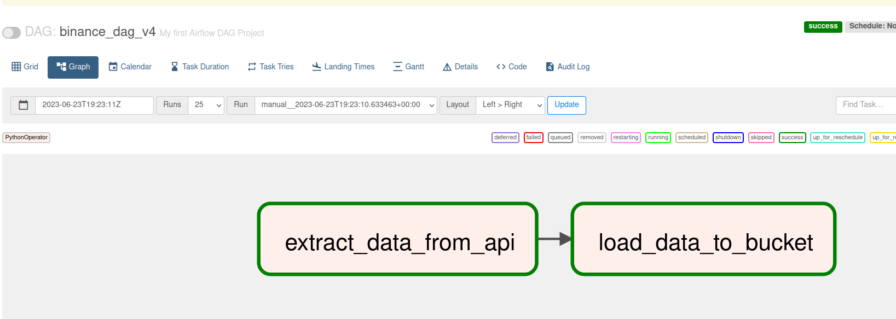

In this project, I used the scripts I wrote in the Binance Data Pipeline project before. extract_data.py and load_data.py scripts. Only the function part of the extract_data.py script has been updated.

extract_data.py script extracts the data of BTCUSD coin between June 21, 2023 - June 23, 2023 from Binance API and then converts it to CSV file.

The load_data.py script loads the extracted CSV file into the Google Cloud Storage Bucket.

DAG was created to manage data flow and workflow in airflow_pipeline_run.py script. With this flow, first the extract_data step worked, then the load_data worked. The DAG was triggered by opening the Airflow Web UI face by running the airflow webserver and airflow scheduler commands in the terminal.

<h1>DAG</h1>
